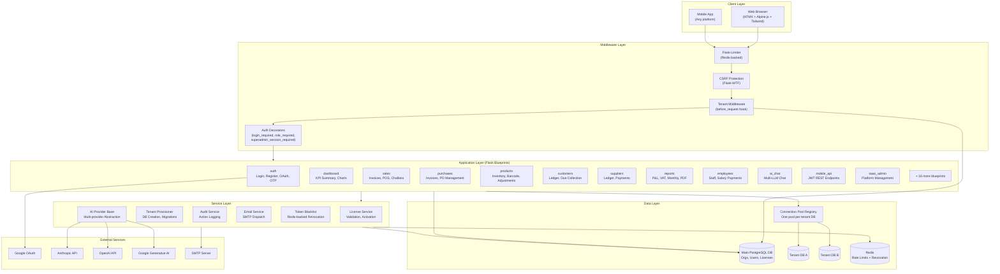
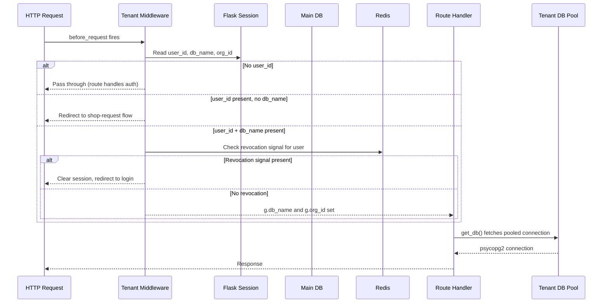
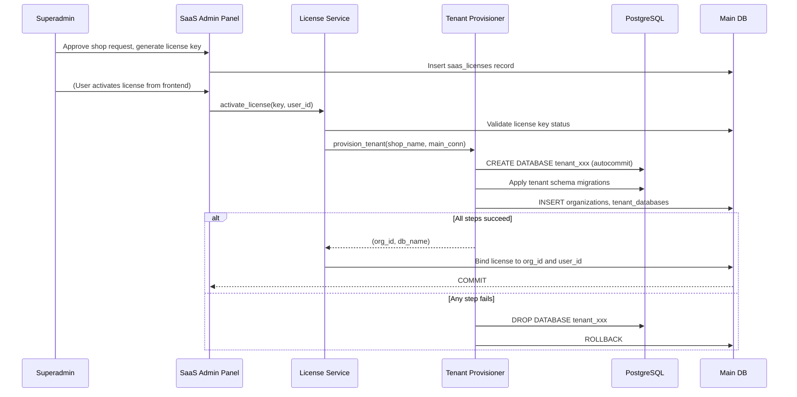

# Architecture: Ravelweb Nexus

## System Overview

Ravelweb Nexus is a multi-tenant SaaS application. One running instance of the application
serves all tenants. Each tenant (organization) has its own dedicated PostgreSQL database.
A main (control) database stores platform-level metadata: organizations, users, license keys,
shop requests, and tenant database routing.

The Flask application acts as the routing layer. On every request, a middleware hook looks up
the tenant database name from the session and makes it available to all route handlers.

---

## Component Interaction



---

## Data Flow: Tenant Request Lifecycle



---

## Data Flow: Tenant Provisioning



---

## Multi-Tenancy Model

**Approach:** Database-per-tenant isolation.

Each organization gets a dedicated PostgreSQL database created at activation time. The
database name is stored in the `tenant_databases` table and cached in the user's session.

Benefits of this approach:
- Zero risk of cross-tenant data leakage through query bugs
- Tenant databases can be independently backed up and restored
- A single tenant's heavy query load does not compete with other tenants at the query level
- Easy offboarding: drop the database and clean up the main DB record

Trade-offs accepted:
- More databases to manage (monitoring, backup coverage)
- Schema migrations must be applied to all tenant databases
- Connection pool overhead grows with the number of active tenants

---

## Connection Pool Design

The application maintains a `ThreadedConnectionPool` per tenant database. Pools are created
lazily on first access and kept alive for the lifetime of the process.

Connections are sanitized on checkout: if a connection was returned with an open or aborted
transaction (e.g., after an unhandled exception), it is rolled back before being handed to
the next request. This prevents one bad request from poisoning subsequent requests.

---

## Service Dependency Map

| Service | Depends On | Used By |
|---------|-----------|---------|
| Tenant Provisioner | PostgreSQL (admin URL), main DB | SaaS Admin, Shop Request |
| License Service | Main DB | Shop Request, Settings |
| Audit Service | Main DB (admin audit), Tenant DB (per-tenant audit) | All write routes |
| Email Service | SMTP configuration | Auth (verification), Error alerts |
| Token Blacklist | Redis | Mobile API (logout), Session revocation |
| AI Provider Base | Anthropic/OpenAI/Google SDKs, Main DB (provider config) | AI Chat Blueprint |

---

## Invoice Numbering: PostgreSQL Trigger Approach

Invoice numbers (e.g., `INV-202506-42`) are generated by a database trigger on each insert
rather than in application code. This eliminates race conditions under concurrent writes
without any application-level locking.

```
BEFORE INSERT ON sale_invoices
  IF invoice_number IS NULL THEN
    invoice_number = prefix + '-' + YYYYMM + '-' + NEW.id
  END IF
```

The prefix is read from `shop_settings` so each tenant can configure their own prefix.

---

## Stock Calculation: Derived View

Current stock is not stored as a column. It is computed on-demand by a PostgreSQL view:

```
current_stock =
  previous_stock (opening balance)
  + SUM(purchase_items.quantity)
  - SUM(supplier_return_items.quantity)
  - SUM(sale_items.quantity WHERE invoice.status != 'void')
  + SUM(customer_return_items.quantity)
  + SUM(stock_adjustments.quantity WHERE type = 'add')
  - SUM(stock_adjustments.quantity WHERE type = 'remove')
```

This approach means stock is always accurate. There is no incremental counter that can drift
out of sync after a rollback or a bug.

---

## AI Chat Architecture

The AI Chat module uses a three-layer design:

1. **Provider Base Layer:** A common interface for sending messages and receiving responses,
   with token and cost tracking. Implemented for Anthropic, OpenAI, and Google Gemini.

2. **Provider Management Layer:** Superadmin configures which provider is active for the
   platform. API keys are encrypted at rest using Fernet symmetric encryption derived from
   `SECRET_KEY`. The active provider is fetched per-request with automatic key decryption.

3. **Budget Enforcement Layer:** Each organization has an optional monthly spend cap. Before
   any chat request is processed, the current month's spend is checked against the cap. If
   the cap is exceeded, the request is rejected with a clear error message.

---

## License System Architecture

The license system has two independent layers that both run on every validation:

**Layer 1 (JWT Signature):** The license key is a signed JWT. The signature is verified
against a shared secret. This proves the key was issued by the platform operator.

**Layer 2 (Database Status):** Even a valid JWT is rejected if the main database shows the
key as `revoked` or `suspended`. This allows instant revocation without waiting for
JWT expiry.

This two-layer design means the operator can issue long-lived or perpetual license tokens
and still revoke them at any time.

---

## Error Handling Strategy

- 404 and 500 errors return JSON for API paths and HTML for browser paths, detected by
  request content type and path prefix.
- Unhandled 500 errors trigger a non-blocking email alert if SMTP is configured.
- Database errors within the middleware layer degrade gracefully: if a context processor
  fails to load currency or feature flag settings, it returns safe defaults rather than
  crashing the request.
