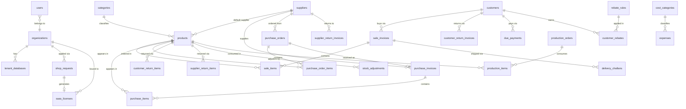

# Database Overview: Ravelweb Nexus

## Architecture

The system uses two categories of PostgreSQL databases:

1. **Main (Control) Database** -- one, shared across the platform. Stores organizations,
   users, licenses, shop requests, and tenant routing metadata.

2. **Tenant Databases** -- one per organization. Stores all business data for that tenant.
   Provisioned automatically when a license is activated.

This isolation model means no cross-tenant data access is possible through query bugs.
Each database is independently backupable and restorable.

---

## Entity Relationship Overview

---

## Main Database Tables

### organizations

One record per registered business on the platform.

| Purpose | Stores the organization name, registration date, and feature flags |
|---------|-------------------------------------------------------------------|
| Key Relationships | One organization has many users and one tenant database |
| Notable Columns | `ai_chat_enabled`, `ai_chat_budget_usd` for AI feature control |

---

### users

All users across all tenants. Authentication data lives here.

| Purpose | Central user registry for all tenants |
|---------|---------------------------------------|
| Key Relationships | Belongs to one organization; mirrored to tenant DB for queries |
| Notable Columns | `account_status`, `email_verified`, `is_superadmin`, `google_id` |

---

### tenant_databases

Maps each organization to its dedicated PostgreSQL database.

| Purpose | Tenant routing table |
|---------|---------------------|
| Key Relationships | One-to-one with organizations |
| Notable Columns | `db_name` (the actual PostgreSQL database name) |

---

### shop_requests

New business registration requests from users.

| Purpose | Onboarding queue reviewed by superadmin |
|---------|----------------------------------------|
| Status Flow | `waiting_for_approval` → `approved` or `rejected` |
| Notable Columns | `shop_name`, `status`, `reviewed_by`, `reject_reason` |

---

### saas_licenses

License keys that activate tenant provisioning.

| Purpose | Controlled access provisioning |
|---------|-------------------------------|
| Key Relationships | Linked to a shop request; bound to an organization after activation |
| Status Values | `active`, `inactive`, `revoked` |
| Notable Columns | `bound_to`, `bind_type`, `expiry`, `activated_at`, `revoked_at` |

---

### auth_tokens

Refresh tokens for the mobile REST API.

| Purpose | JWT refresh token storage with revocation support |
|---------|--------------------------------------------------|
| Notable Columns | `token_hash`, `user_id`, `expires_at`, `revoked` |

---

### ai_providers

LLM provider configuration set by the superadmin.

| Purpose | Store which AI provider is active and its (encrypted) API key |
|---------|--------------------------------------------------------------|
| Notable Columns | `name`, `protocol`, `api_key` (encrypted), `model`, `is_active` |

---

### ai_chat_usage

Token consumption and cost tracking per organization per session.

| Purpose | Budget enforcement and usage analytics |
|---------|----------------------------------------|
| Notable Columns | `org_id`, `user_id`, `model`, `input_tokens`, `output_tokens`, `cost_usd` |

---

### admin_audit_log

SaaS-level admin action history.

| Purpose | Platform-level accountability |
|---------|------------------------------|
| Notable Columns | `actor_id`, `action`, `target`, `tenant_id`, `metadata` |

---

### support_tickets

In-app support ticket system.

| Purpose | Communication channel between tenants and the platform operator |
|---------|----------------------------------------------------------------|
| Notable Columns | `org_id`, `subject`, `status`, `messages` |

---

## Tenant Database Tables

### shop_settings

One row per tenant. Stores all per-tenant configuration.

| Purpose | Tenant preferences: currency, date format, invoice prefix, feature flags |
|---------|-------------------------------------------------------------------------|
| Notable Columns | `currency`, `currency_symbol`, `currency_format`, `date_format`, `invoice_prefix`, `production_module`, `rebate_module`, `license_key` |

---

### roles

Pre-seeded role definitions for RBAC.

| Values | Admin, Manager, Salesman |
|--------|--------------------------|

---

### users

Tenant-local mirror of the main DB users table.

| Purpose | Allow JOIN queries with business data without cross-database calls |
|---------|-------------------------------------------------------------------|
| Sync Strategy | Written on login and on admin user creation |

---

### products

The product catalog.

| Purpose | All items the business buys and sells |
|---------|--------------------------------------|
| Key Relationships | Belongs to category and supplier; appears in sale/purchase line items |
| Notable Columns | `barcode`, `sku`, `cost_price`, `sell_price`, `previous_stock`, `stock_low_alert`, `is_inhouse` |

---

### categories

Product categories (flat list).

---

### customers

Customer records.

| Purpose | Customer contact, credit, and discount configuration |
|---------|-----------------------------------------------------|
| Notable Columns | `customer_type` (retail/wholesale), `opening_balance`, `credit_limit`, `standard_discount`, `priority` |

---

### suppliers

Supplier records.

| Purpose | Supplier contact and opening balance |
|---------|-------------------------------------|

---

### sale_invoices

Sale invoice headers.

| Purpose | One record per sale transaction |
|---------|--------------------------------|
| Key Relationships | Has many sale_items; linked to customer, delivery challan |
| Status Values | `active`, `void` |
| Notable Columns | `invoice_number` (trigger-generated), `sale_type`, `amount_paid`, `amount_due` |

---

### sale_items

Line items within a sale invoice.

| Notable Columns | `product_id`, `quantity`, `unit_price`, `cost_price`, `discount_pct`, `total` |

---

### purchase_invoices

Purchase invoice headers.

| Purpose | One record per purchase transaction |
|---------|-------------------------------------|
| Key Relationships | Has many purchase_items; optionally linked to a purchase_order |

---

### purchase_items

Line items within a purchase invoice.

---

### purchase_orders

Planned procurement orders.

| Status Flow | `draft` → `sent` → `partially_received` → `received` |
|-------------|------------------------------------------------------|

---

### purchase_order_items

Line items within a purchase order. Tracks `received_qty` for partial receipt.

---

### customer_return_invoices / customer_return_items

Customer returns. Increases product stock. Reduces customer balance.

---

### supplier_return_invoices / supplier_return_items

Supplier returns. Decreases product stock. Reduces supplier balance.

---

### due_payments

Customer due collection records.

| Purpose | Track cash collected from customers who had outstanding balances |

---

### supplier_payments

Payments made to suppliers.

---

### delivery_challans / delivery_challan_items

Physical delivery documents linked to sale invoices.

| Status Values | `pending`, `delivered` |

---

### vouchers

Miscellaneous debit and credit transactions.

| Notable Columns | `type` (debit/credit), `party_type` (customer/supplier), `party_id` |

---

### employee_salaries

Monthly salary payment records.

| Notable Columns | `employee_id`, `month`, `year`, `payment_type`, `amount` |
| Uniqueness | (employee_id, month, year, payment_type) |

---

### production_orders / production_items

Manufacturing order tracking. Consumes raw materials; produces finished goods.

---

### rebate_rules

Annual purchase volume rebate tiers.

| Notable Columns | `min_purchase_amount`, `max_purchase_amount`, `rebate_pct` |

---

### customer_rebates

Annual rebate calculation and payment records per customer.

| Status Values | `pending`, `approved`, `paid` |
| Notable Columns | `year`, `total_purchases`, `rebate_amount` |

---

### expenses / cost_categories

Business expense records and their categories.

| System Categories | General Expense, Rent, Utilities, Salary, Transport, Employee Payment, Supplier Payment |
|-------------------|---------------------------------------------------------------------------------------|

---

### stock_adjustments

Manual inventory add and remove records with reason tracking.

| Notable Columns | `type` (add/remove), `quantity`, `reason`, `created_by` |

---

### daily_ledger

Running debit/credit ledger for overall cash flow tracking.

---

### audit_log

Per-tenant action log. Every write operation records a row here.

| Notable Columns | `user_id`, `user_name`, `action`, `module`, `record_id`, `description`, `ip_address` |

---

### notifications

In-app notifications per user.

| Types | Low-stock alerts, support reply notifications |

---

### payment_methods

Configurable payment method list.

| Default Values | Cash, Bank Transfer, Mobile Banking |

---

## Indexing Strategy

### Date Columns

All date columns used in report queries carry dedicated indexes:
`sale_invoices(sale_date)`, `purchase_invoices(purchase_date)`, `expenses(expense_date)`,
`daily_ledger(ledger_date)`, `audit_log(created_at DESC)`.

### Foreign Keys

All FK columns used in JOIN-heavy queries are indexed:
product/customer/supplier relationships in invoices, items tables, and return tables.

### Status Columns

`sale_invoices(status)`, `purchase_invoices(status)`, `purchase_orders(status)`,
`stock_adjustments` -- filtered in most queries.

### Partial Indexes

`users(email)` has a partial unique index `WHERE email IS NOT NULL` to allow nullable
email with uniqueness only for non-null values.

`expenses(ref_type, ref_id)` has a partial unique index
`WHERE ref_type IS NOT NULL AND ref_id IS NOT NULL` to prevent duplicate auto-expense
entries for the same source record.

---

## Database Views

### v_product_stock

Computes current stock for every active product by summing:
- Opening stock (`previous_stock`)
- Plus: purchases, customer returns, positive stock adjustments
- Minus: sales (void-excluded), supplier returns, negative stock adjustments

This view is used by the low-stock notification context processor, the product detail page,
and the inventory report.

---

## Database Triggers

### trg_sale_invoice_number

Fires before insert on `sale_invoices`. Sets `invoice_number` to:
`{invoice_prefix}-{YYYYMM}-{id}` using the prefix from `shop_settings`.

### trg_purchase_invoice_number

Fires before insert on `purchase_invoices`. Sets `invoice_number` to:
`PUR-{YYYYMM}-{id}`.

Using triggers for this ensures sequential, gap-free numbering under concurrent writes
without any application-level locking.
