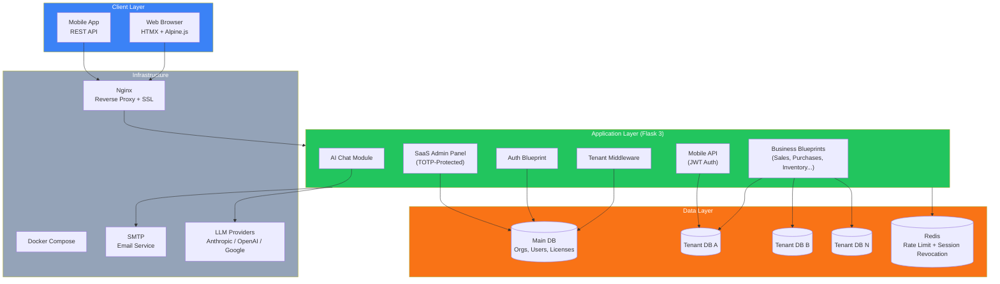
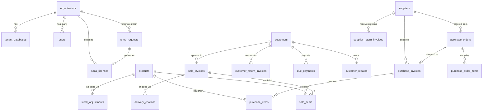
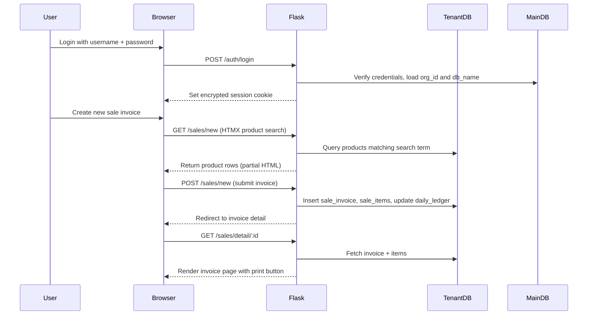

# Ravelweb Nexus

> A multi-tenant SaaS business management platform for small and medium retailers.

Ravelweb Nexus is a full-stack web application that replaces disconnected spreadsheets and paper
ledgers. It covers sales, purchasing, inventory, customer due tracking, employee payroll, expenses,
and financial reports in one place. Each customer gets a fully isolated PostgreSQL database
provisioned automatically on signup.

> **Portfolio Note:** This is a public showcase repository. It contains architecture documentation,
> design decisions, and skeleton code structure -- the full production implementation is proprietary.
> The engineering depth, system design, and problem-solving approach demonstrated here reflect the
> real project.

---

[](https://nexus.ravelweb.com)

> **Demo credentials** — Username: `admin` · Password: `admin123`

---

## Table of Contents

- [Problem Statement](#problem-statement)
- [Solution Overview](#solution-overview)
- [Architecture Overview](#architecture-overview)
- [Features](#features)
- [Technology Stack](#technology-stack)
- [Database Design](#database-design)
- [User Roles and Permissions](#user-roles-and-permissions)
- [System Design Decisions](#system-design-decisions)
- [API Overview](#api-overview)
- [Project Structure](#project-structure)
- [Deployment Architecture](#deployment-architecture)
- [Development Journey](#development-journey)
- [Technical Skills Demonstrated](#technical-skills-demonstrated)
- [Project Metrics](#project-metrics)
- [Screenshots](#screenshots)
- [Case Study](#case-study)
- [Setup](#setup-development-reference-only)
- [License](#license)

---

## Problem Statement

Small retail businesses in Bangladesh and similar markets run on a mix of paper notebooks,
WhatsApp messages, and basic spreadsheets. They track sales in one place, supplier dues in
another, and employee salaries in a third. When the owner wants to know today's profit, they
have to piece it together manually.

Off-the-shelf software is either too expensive, too complex, or built for large enterprises.
Lighter options lack critical features like proper due tracking, purchase orders, or production
management. Most of them do not support multi-user access with role separation.

The result: business owners spend hours each week on data entry that should take minutes, miss
low-stock alerts, lose track of customer dues, and have no clear picture of whether their
business is profitable.

## Solution Overview

Ravelweb Nexus gives each business a dedicated, isolated environment on a shared platform. The
owner registers, submits a shop request, and receives a license key. Activating the key
provisions a fresh PostgreSQL database for that business and sets up all tables automatically.

From that point, the team can log in with role-based accounts and manage sales, purchasing,
inventory, customers, suppliers, employees, expenses, and reports from a single web interface.
A mobile REST API supports future mobile app clients. An AI chat module lets the platform
operator plug in any LLM provider (Anthropic, OpenAI, or Google) per organization.

---

## Architecture Overview

The platform uses a shared-infrastructure, isolated-data multi-tenancy model. One main
(control) PostgreSQL database stores organizations, users, licenses, and routing metadata.
Each tenant gets its own PostgreSQL database, provisioned on-demand. The Flask application
resolves the correct tenant database on every request using session data, with no cross-tenant
data access possible.

### System Diagram

> View this diagram: open the `.mmd` file in [Mermaid Live Editor](https://mermaid.live)



### Component Breakdown

| Component           | Responsibility                                                              |
| ------------------- | --------------------------------------------------------------------------- |
| Tenant Middleware   | Resolves the correct tenant database from the session on every request      |
| Auth Blueprint      | Login, registration, Google OAuth, OTP verification, password recovery      |
| Business Blueprints | 20+ feature modules: sales, purchases, inventory, customers, reports, etc.  |
| SaaS Admin Panel    | Platform-level management: organizations, licenses, tickets, AI settings    |
| Mobile API          | JWT-secured REST endpoints for mobile app clients                           |
| AI Chat Module      | Multi-provider LLM integration with per-org budget tracking                 |
| Main Database       | Stores organizations, users, licenses, shop requests, and tenant routing    |
| Tenant Databases    | Isolated per-tenant storage: products, invoices, customers, employees, etc. |
| Redis               | Rate limiting and session revocation signals                                |

---

## Features

### Sales and POS

**Purpose:** Create sale invoices, collect payments, and issue delivery challans.

**User Workflow:** Salesman searches for products by name or barcode, sets quantities and
discounts, selects a payment method, and submits. The invoice is saved, stock is updated,
and a printable PDF is available immediately.

**Business Value:** Replaces manual receipt writing. Tracks unpaid balances automatically.
Supports retail and wholesale sale types with different pricing and discount rules.

**Technical Summary:** HTMX-powered product search with live results. Auto-generated invoice
numbers from a PostgreSQL trigger. PDF export using xhtml2pdf with Bangla font support via
a bundled TTF file.

---

### Purchase Management

**Purpose:** Record supplier invoices, update inventory, and track amounts owed to suppliers.

**User Workflow:** Manager selects a supplier, adds purchased products and quantities, records
payment, and submits. Stock increases immediately. A purchase order workflow is available for
planned procurement with partial receive support.

**Business Value:** Tracks what the business owes each supplier. Purchase orders prevent
over-ordering and give suppliers a formal document.

**Technical Summary:** Linked purchase orders and invoices with status progression (draft,
partially received, received). Cascade stock adjustments on save.

---

### Inventory Management

**Purpose:** Track stock levels, alert on low stock, adjust quantities, and print barcodes.

**User Workflow:** Admin configures a low-stock threshold per product. The dashboard and
notification bar show which products are below threshold. Manual adjustments (add/remove)
are logged with a reason for audit purposes.

**Business Value:** Prevents stock-outs. Gives a single source of truth for current stock
without manual counting.

**Technical Summary:** Stock is calculated from a PostgreSQL view that sums opening stock,
purchases, sales, returns, and adjustments. A built-in Code128-B barcode renderer generates
PNG barcodes server-side without any external library dependency.

---

### Customer and Supplier Ledgers

**Purpose:** Track every transaction with each customer and supplier with running balances.

**User Workflow:** Manager opens a customer profile and sees a full transaction history:
every sale invoice, return, and payment in date order with a running due balance.

**Business Value:** Business owner knows exactly who owes what without maintaining a
separate notebook. Support for opening balances from before the software was installed.

**Technical Summary:** Ledger is computed dynamically by querying sales, returns, and
payments for the entity. Pagination handles large histories. A PDF export is available.

---

### Employee Management and Payroll

**Purpose:** Store employee records and log monthly salary payments.

**User Workflow:** Admin adds employees with role assignment, salary, and join date. Each
month, the admin records salary payments with payment method and optional notes.

**Business Value:** Replaces paper salary registers. Provides a searchable history of
all salary disbursements per employee.

**Technical Summary:** Employees are stored in the tenant database as users with the
Salesman role. Role-based payroll access is enforced via route decorators.

---

### Financial Reports

**Purpose:** Give the business owner a complete financial picture without an accountant.

**User Workflow:** Admin selects a report type (P&L, monthly summary, VAT report, best-
selling products, customer sales, supplier purchases, or full ledger) and a date range.

**Business Value:** Answers "did I make money this month?" without manual calculation.
VAT report supports tax filing.

**Technical Summary:** All reports are computed with parameterized SQL queries. Monthly
comparison periods use `DATE_TRUNC`. No caching layer; queries are optimized with targeted
indexes on date and foreign key columns.

---

### Analytics Dashboard

**Purpose:** Show key business metrics at a glance with charts.

**User Workflow:** Admin opens the dashboard and sees today's sales, monthly trends,
top products, and cash flow at a configurable default period.

**Business Value:** Instant visibility into business performance without opening a
separate report.

**Technical Summary:** Chart data is served as JSON from dedicated API endpoints.
Charts rendered on the client side.

---

### AI Chat Module

**Purpose:** Let staff ask business questions in natural language using an LLM.

**User Workflow:** User opens the AI chat panel and types a question. The platform
sends the message to the configured LLM provider and streams the response back.

**Business Value:** Platform operator can offer an AI assistant as an add-on feature per
organization, controlled by a budget cap.

**Technical Summary:** Multi-provider abstraction layer supports Anthropic Claude, OpenAI
GPT, and Google Gemini. Provider selection and API keys are configured by the superadmin.
Per-organization monthly spend is tracked and enforced. API keys are encrypted at rest
using Fernet symmetric encryption derived from the app secret.

---

### SaaS Admin Panel

**Purpose:** Platform operator manages all organizations, licenses, and system settings.

**User Workflow:** Superadmin logs in with TOTP two-factor authentication, reviews shop
requests, generates license keys, assigns AI providers to organizations, views audit logs,
and handles support tickets.

**Business Value:** Full platform control without direct database access. License management
supports controlled onboarding and offboarding.

**Technical Summary:** TOTP 2FA using the `pyotp` library. Separate admin Blueprint with
its own base template and sidebar. Full audit trail stored in the main database. Tenant
offboarding flow drops the tenant database and cleans up all references.

---

### License Management System

**Purpose:** Control which organizations can access the platform and for how long.

**User Workflow:** Admin generates a license key for an approved shop request. User
activates the key to provision their tenant database. License expiry warnings appear
in the application 14, 7, and 3 days before expiry.

**Business Value:** The operator controls access and can revoke or suspend tenants.
Licenses can be bound to specific users to prevent sharing.

**Technical Summary:** JWT-based license tokens with expiry verification. Main database
acts as the authoritative revocation source so database-revoked licenses cannot be
reactivated with a locally cached token.

---

### Mobile REST API

**Purpose:** Provide a JSON API for mobile app clients.

**User Workflow:** Mobile app authenticates with username and password, receives access
and refresh tokens, and calls endpoints for sales, products, customers, and reports.

**Business Value:** Enables future mobile app development without rebuilding the backend.

**Technical Summary:** Separate Blueprint with CSRF exemption. JWT access tokens with 30-
minute expiry and 7-day refresh tokens. Token blacklist via Redis for logout and revocation.

---

### Expense Tracking

**Purpose:** Record all business outgoings by category.

**User Workflow:** Admin records an expense with a category, amount, date, and optional
reference. System expense categories (salary, rent, utilities) are seeded automatically.

**Business Value:** Cash flow tracking alongside income. Expenses feed into the P&L report.

**Technical Summary:** Auto-expense records are created from salary payments and supplier
payments automatically to avoid double-entry. A partial unique constraint prevents
duplicate auto-entries per reference.

---

### Quotations

**Purpose:** Create price quotations for potential orders.

**User Workflow:** Salesman creates a quotation with customer details and line items.
Quotations can be printed and converted to sale invoices.

**Business Value:** Gives customers a formal price document without committing inventory.

---

### Production Orders

**Purpose:** Track manufacturing jobs that consume raw materials and produce finished goods.

**User Workflow:** Manager creates a production order for a finished product, lists raw
material inputs, and marks it complete. Raw material stock decreases; finished product
stock increases.

**Business Value:** Supports businesses that both manufacture and sell, without needing a
separate manufacturing system.

---

### Customer Rebates

**Purpose:** Reward high-volume customers with annual rebates based on purchase totals.

**User Workflow:** Admin configures rebate rules (purchase amount tiers and rebate
percentages). At year end, the system calculates which customers qualify and the rebate
amounts. Payments are logged and deducted from the ledger.

---

### Vouchers

**Purpose:** Record miscellaneous debit and credit transactions for customers and suppliers.

**User Workflow:** Admin creates a voucher (debit or credit), selects a party, enters the
amount and payment method, and saves. Vouchers appear in the ledger.

---

## Technology Stack

> View this diagram: open the `.mmd` file in [Mermaid Live Editor](https://mermaid.live)

| Layer          | Technology              | Purpose                                            |
| -------------- | ----------------------- | -------------------------------------------------- |
| Frontend       | Jinja2 + HTMX           | Server-rendered templates with partial updates     |
| Frontend       | Alpine.js               | Lightweight client state for UI interactions       |
| Frontend       | Tailwind CSS CDN        | Utility-first styling                              |
| Backend        | Python 3.13 + Flask 3   | Application framework and routing                  |
| Backend        | Flask-WTF               | CSRF protection on all forms                       |
| Backend        | Flask-Limiter           | Rate limiting on auth and sensitive endpoints      |
| Database       | PostgreSQL              | Per-tenant and main database                       |
| Database       | psycopg2                | PostgreSQL driver with connection pooling          |
| Cache          | Redis                   | Rate limit storage and session revocation          |
| Auth           | PyJWT                   | JWT tokens for mobile API and license verification |
| Auth           | pyotp                   | TOTP two-factor authentication for superadmin      |
| Auth           | Authlib                 | Google OAuth 2.0 integration                       |
| AI             | Anthropic SDK           | Claude LLM provider                                |
| AI             | OpenAI SDK              | GPT provider                                       |
| AI             | Google Generative AI    | Gemini provider                                    |
| PDF            | xhtml2pdf               | Server-side invoice and ledger PDF generation      |
| Export         | openpyxl                | Excel export for reports                           |
| Security       | cryptography (Fernet)   | API key encryption at rest                         |
| Infrastructure | Docker + Docker Compose | Containerized deployment                           |
| Infrastructure | Gunicorn                | WSGI application server                            |
| Infrastructure | Nginx                   | Reverse proxy and SSL termination                  |

---

## Database Design

The system uses two categories of databases: one main database and one database per tenant.

### Entity Overview

> View this diagram: open the `.mmd` file in [Mermaid Live Editor](https://mermaid.live)



### Main Database Tables

| Table            | Purpose                                                |
| ---------------- | ------------------------------------------------------ |
| organizations    | One row per registered business                        |
| users            | All users across all tenants                           |
| tenant_databases | Maps each organization to its PostgreSQL database name |
| shop_requests    | New business registration requests awaiting approval   |
| saas_licenses    | License keys linking shop requests to organizations    |
| auth_tokens      | JWT refresh tokens for mobile API                      |
| ai_providers     | LLM provider configuration (encrypted API keys)        |
| ai_chat_usage    | Token and cost tracking per organization per month     |
| admin_audit_log  | SaaS-level admin action log                            |
| support_tickets  | In-app support ticket system                           |

### Tenant Database Tables

| Table                    | Purpose                                                   |
| ------------------------ | --------------------------------------------------------- |
| products                 | Product catalog with cost/sell prices and barcode         |
| categories               | Product categories                                        |
| customers                | Customer records with credit limits and discount          |
| suppliers                | Supplier records with contact and opening balance         |
| sale_invoices            | Sale invoice headers with payment status                  |
| sale_items               | Line items for each sale invoice                          |
| purchase_invoices        | Purchase invoice headers                                  |
| purchase_items           | Line items for each purchase invoice                      |
| purchase_orders          | Planned procurement orders                                |
| purchase_order_items     | Line items for purchase orders                            |
| customer_return_invoices | Customer return headers                                   |
| customer_return_items    | Line items for customer returns                           |
| supplier_return_invoices | Supplier return headers                                   |
| supplier_return_items    | Line items for supplier returns                           |
| due_payments             | Customer due collection records                           |
| supplier_payments        | Supplier payment records                                  |
| delivery_challans        | Delivery documents linked to sale invoices                |
| delivery_challan_items   | Line items for delivery challans                          |
| vouchers                 | Debit and credit vouchers for customers and suppliers     |
| employee_salaries        | Monthly salary payment records                            |
| production_orders        | Manufacturing order headers                               |
| production_items         | Raw material consumption per production order             |
| rebate_rules             | Annual rebate percentage tiers                            |
| customer_rebates         | Calculated and paid rebates per customer per year         |
| expenses                 | Business expense records by category                      |
| cost_categories          | Expense categories with system-seeded defaults            |
| stock_adjustments        | Manual inventory add/remove records                       |
| daily_ledger             | Running debit/credit ledger entries                       |
| shop_settings            | Per-tenant configuration (currency, invoice prefix, etc.) |
| payment_methods          | Configurable payment method list                          |
| notifications            | In-app notifications per user                             |
| audit_log                | Per-tenant action log                                     |
| users                    | Tenant mirror of main DB users for JOIN queries           |
| roles                    | Role definitions (Admin, Manager, Salesman)               |

---

## User Roles and Permissions

| Role       | Description       | Key Permissions                                                              |
| ---------- | ----------------- | ---------------------------------------------------------------------------- |
| Superadmin | Platform operator | Full platform access, TOTP-protected, manages all organizations and licenses |
| Admin      | Business owner    | Full access to all modules for their organization                            |
| Manager    | Senior staff      | Access to purchases, reports, employee management; no settings access        |
| Salesman   | Counter staff     | Sales, quotations, and customer-facing operations only                       |

---

## System Design Decisions

### Design Patterns Used

- **Blueprint Pattern:** Each feature is a separate Flask Blueprint, keeping modules independent and testable in isolation.
- **Middleware-First Tenant Resolution:** A before-request hook resolves the tenant database before any route handler runs. Routes never need to look up the tenant themselves.
- **Repository-Style DB Access:** All database calls use raw psycopg2 with parameterized queries. No ORM was used to keep query control explicit and avoid N+1 issues.
- **Connection Pooling Per Tenant:** Each tenant database has its own `ThreadedConnectionPool`. Connections are sanitized on checkout to handle aborted transactions from previous requests.
- **Database-Level Invoice Numbering:** Invoice numbers are generated by PostgreSQL triggers, not application code. This ensures sequential, gap-free numbering under concurrent writes.

### Multi-Tenancy Approach

Each tenant has a dedicated PostgreSQL database. The database name is stored in the session
after login and used to connect to the correct database on each request. There is no
shared-schema or row-level tenancy. Data isolation is enforced at the database level, not
the application level. This avoids an entire class of cross-tenant data leakage bugs.

New tenant databases are provisioned atomically: the physical database is created first,
then migrations are applied, then the organization record is written to the main database.
If any step fails, the physical database is dropped and the main database transaction is
rolled back.

### Security Approach

Authentication uses Flask's encrypted server-side sessions. The mobile API uses short-lived
JWT access tokens with refresh token rotation. The SaaS admin panel requires TOTP 2FA in
addition to password authentication. All passwords are hashed with Werkzeug's default
PBKDF2 implementation. Session revocation signals are pushed to Redis so active sessions
can be invalidated server-side without waiting for cookie expiry.

### Scalability Approach

The connection pool design allows the application to handle multiple tenants concurrently
without opening a new connection for every request. Redis is used for rate limiting so the
limit state is shared across multiple Gunicorn workers. The architecture supports horizontal
scaling by adding more Gunicorn workers; the stateless application layer makes this
straightforward.

---

## API Overview

> View this diagram: open the `.mmd` file in [Mermaid Live Editor](https://mermaid.live)



### Endpoint Categories

| Category   | Purpose                                            | Auth Required           |
| ---------- | -------------------------------------------------- | ----------------------- |
| Auth       | Login, register, Google OAuth, OTP, password reset | No (public)             |
| Dashboard  | KPI summary, chart data                            | Session                 |
| Sales      | Invoice CRUD, delivery challans, POS               | Session + Role          |
| Purchases  | Purchase invoices, purchase orders                 | Session + Role          |
| Inventory  | Products, categories, stock adjustments, barcodes  | Session + Role          |
| Customers  | Customer records, ledger, due collection           | Session + Role          |
| Suppliers  | Supplier records, ledger, payments                 | Session + Role          |
| Reports    | P&L, monthly, VAT, best-selling, ledger PDF        | Session + Role          |
| Employees  | Staff records, salary payments                     | Session + Admin/Manager |
| Expenses   | Expense records and categories                     | Session + Role          |
| Mobile API | Full REST API for mobile clients                   | JWT Bearer token        |
| SaaS Admin | Organizations, licenses, tickets, AI settings      | Session + TOTP          |

---

## Project Structure

```
ravelweb-nexus-public/
├── README.md                      ← You are here
├── ARCHITECTURE.md                ← Deep technical architecture
├── FEATURES.md                    ← Full feature documentation
├── DATABASE_OVERVIEW.md           ← Schema and data model overview
├── DEPLOYMENT_OVERVIEW.md         ← Infrastructure and deployment
├── SECURITY_OVERVIEW.md           ← Security model overview
├── CASE_STUDY.md                  ← Client-facing project story
├── .env.example                   ← Environment variable template
│
├── src/
│   ├── run.py                     ← Application entry point
│   ├── config.py                  ← Configuration classes (skeleton)
│   ├── app/
│   │   ├── __init__.py            ← Application factory (skeleton)
│   │   ├── db.py                  ← Database connection layer (skeleton)
│   │   ├── license.py             ← License verification (skeleton)
│   │   ├── tenant.py              ← Tenant provisioning (skeleton)
│   │   ├── limiter.py             ← Rate limiter setup
│   │   ├── auth/                  ← Authentication Blueprint
│   │   ├── middleware/            ← Tenant and auth middleware
│   │   ├── services/              ← Shared service modules
│   │   ├── ai_chat/               ← AI Chat Blueprint + providers
│   │   ├── mobile_api/            ← Mobile REST API Blueprint
│   │   ├── saas_admin/            ← SaaS Admin Panel Blueprint
│   │   ├── dashboard/             ← Dashboard Blueprint
│   │   ├── sales/                 ← Sales module
│   │   ├── purchases/             ← Purchases module
│   │   ├── products/              ← Inventory module
│   │   ├── customers/             ← Customers module
│   │   ├── suppliers/             ← Suppliers module
│   │   └── [15+ more modules]     ← All business modules
│   └── migrations/
│       ├── main_db/               ← Control database migrations
│       └── tenant_db/             ← Tenant database schema
│
├── docs/
│   ├── diagrams/
│   │   ├── architecture.mmd       ← System architecture (Mermaid source)
│   │   ├── feature-flow.mmd       ← Primary user flow (Mermaid source)
│   │   ├── tech-stack.mmd         ← Technology layers (Mermaid source)
│   │   └── er-diagram.mmd         ← Entity relationships (Mermaid source)
│   └── screenshots/
│       └── README.md
│
└── LICENSE
```

---

## Deployment Architecture

```
Developer → Git Push → VPS (Docker Compose)
                           |
                           ├── Nginx (reverse proxy, SSL via Let's Encrypt)
                           ├── Flask App (Gunicorn, 4 workers)
                           ├── PostgreSQL (main DB + tenant DBs)
                           └── Redis (rate limiting + session revocation)
```

| Environment | Stack                        | Purpose                             |
| ----------- | ---------------------------- | ----------------------------------- |
| Development | Python + PostgreSQL local    | Local development with `.env`       |
| Production  | Docker Compose on Ubuntu VPS | Single-server production deployment |

---

## Development Journey

### Key Challenges Solved

- **Atomic tenant provisioning:** Creating a new tenant requires three steps: provision a
  PostgreSQL database, run migrations, and write the organization record to the main database.
  These steps cannot all be in one transaction because `CREATE DATABASE` does not support
  rollback. The solution involved a careful orchestration pattern where the physical database
  is dropped on any failure after creation to avoid orphaned databases.

- **Cross-database connection management:** Each request may need both the main database
  (for user/org data) and a tenant database (for business data). The connection pool registry
  needed to handle checkout sanitization properly so aborted transactions from one request
  did not poison the next request on the same connection.

- **Invoice number integrity:** Auto-increment application-side numbering breaks under
  concurrent writes. Using PostgreSQL triggers to generate invoice numbers after row insert
  provides gap-free, sequential numbers without any application-level locking.

- **Session revocation without token expiry waiting:** When a superadmin deactivates a
  tenant or user, active sessions need to be killed immediately. A Redis-based revocation
  signal approach was chosen over a blacklist table to avoid a database round-trip on every
  request.

- **Stock calculation accuracy:** Stock is a derived value (opening + purchases - sales +
  returns +/- adjustments). Computing it as a PostgreSQL view ensures consistency across all
  modules and prevents divergence from incremental counters.

### Architectural Decisions

**Isolated databases vs. shared schema tenancy:** Shared-schema multi-tenancy (row-level
with a `tenant_id` column) is simpler to operate but creates risk. One missing `WHERE
tenant_id = X` clause in any query would expose another tenant's data. Isolated databases
eliminate this risk at the cost of more operational complexity (more databases to back up,
migrate, and monitor). For a business management system handling financial data, the
isolation guarantee was worth the operational cost.

**No ORM:** An ORM was considered but rejected. The system has complex reporting queries
with multiple aggregations, conditional joins, and date arithmetic. Writing these as ORM
query builder chains produces harder-to-read code than plain SQL. Raw psycopg2 with
parameterized queries was chosen for clarity and control.

**Server-rendered with HTMX over a SPA:** A React or Vue SPA would require a separate API
layer, authentication tokens for the web app, and a full build pipeline. HTMX gives
interactive UI (live search, inline updates) without the complexity of a SPA. For a
business tool used on desktops and tablets, this trade-off made sense.

---

## Technical Skills Demonstrated

- **Backend:** Flask application factory pattern, Blueprint architecture, before-request
  middleware, context processors, Jinja2 custom filters, CSRF protection, rate limiting
- **Database:** Multi-database connection pooling, PostgreSQL triggers and views,
  parameterized queries, index strategy, schema migration management
- **Authentication:** Session-based auth, JWT tokens, Google OAuth, TOTP 2FA, token
  revocation via Redis
- **Architecture:** Multi-tenant isolated-database design, service layer separation,
  atomic provisioning with rollback
- **DevOps:** Docker Compose, Gunicorn + Nginx, environment-based configuration, SSL
- **Security:** Encrypted secrets at rest, session revocation, license JWT verification,
  role-based access control, input validation
- **AI/ML Integration:** Multi-provider LLM abstraction layer, per-org budget enforcement,
  encrypted API key storage
- **PDF Generation:** Server-side PDF with Bangla font, custom barcode renderer (no external
  service dependency)

---

## Project Metrics

| Metric                  | Value |
| ----------------------- | ----- |
| Total Flask Blueprints  | 28    |
| API Endpoints (approx.) | 150+  |
| Tenant Database Tables  | 35+   |
| Main Database Tables    | 15+   |
| Major Features          | 22    |
| Migration Files         | 40+   |
| Estimated Complexity    | High  |

---

## Screenshots

> Live demo available upon request. Screenshots provided during a private demo session.

| Screen              | Description                                                           |
| ------------------- | --------------------------------------------------------------------- |
| Dashboard           | KPI cards, monthly sales chart, low-stock alerts, and today's summary |
| Sales (New Invoice) | Live product search, line item entry, payment split                   |
| Customer Ledger     | Full transaction history with running balance                         |
| Reports (P&L)       | Profit and loss for a selected date range                             |
| SaaS Admin Panel    | Organization management, license generation, AI settings              |
| AI Chat             | Chat interface with LLM provider response streaming                   |

---

## Case Study

> See [CASE_STUDY.md](CASE_STUDY.md) for the full client-facing project story covering
> challenge, approach, architecture decisions, and outcomes.

---

## Setup (Development Reference Only)

> This public version contains skeleton code and is **not runnable**.
> Contact me for a private demo or to discuss the full implementation.

### Prerequisites

- Python 3.13+
- PostgreSQL 15+
- Redis 7+

### Environment Variables

```env
# Copy .env.example and fill in your values
DATABASE_URL=YOUR_VALUE_HERE
MAIN_DATABASE_URL=YOUR_VALUE_HERE
SECRET_KEY=YOUR_VALUE_HERE
LICENSE_JWT_SECRET=YOUR_VALUE_HERE
JWT_SECRET_KEY=YOUR_VALUE_HERE
GOOGLE_CLIENT_ID=YOUR_VALUE_HERE
GOOGLE_CLIENT_SECRET=YOUR_VALUE_HERE
MAIL_SERVER=YOUR_VALUE_HERE
MAIL_USERNAME=YOUR_VALUE_HERE
MAIL_PASSWORD=YOUR_VALUE_HERE
REDIS_URL=YOUR_VALUE_HERE
```

---

## License

This repository is published for **portfolio and demonstration purposes only**.
All code is skeleton/placeholder and does not represent the production implementation.
All proprietary business logic and algorithms are retained by the author.

© 2025 Abu Salah Mohammad Asif -- All rights reserved.
